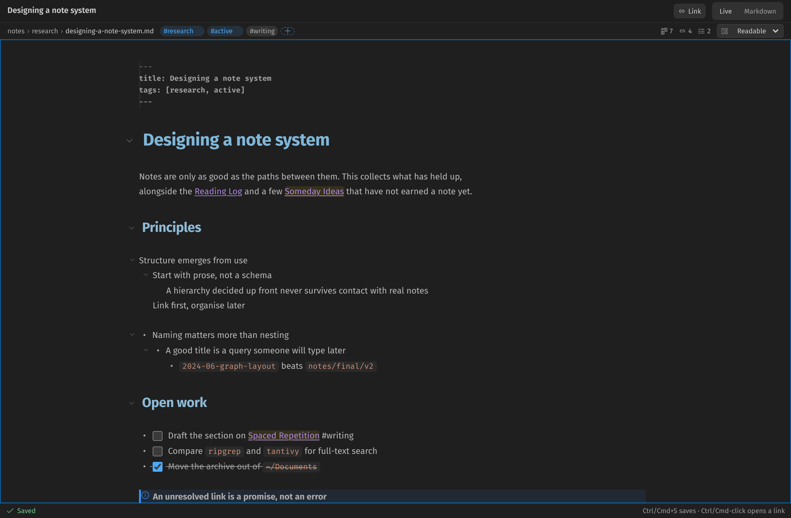
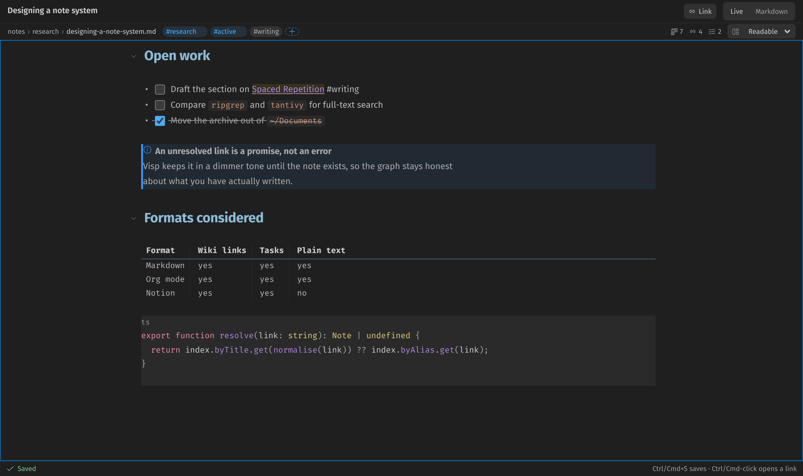
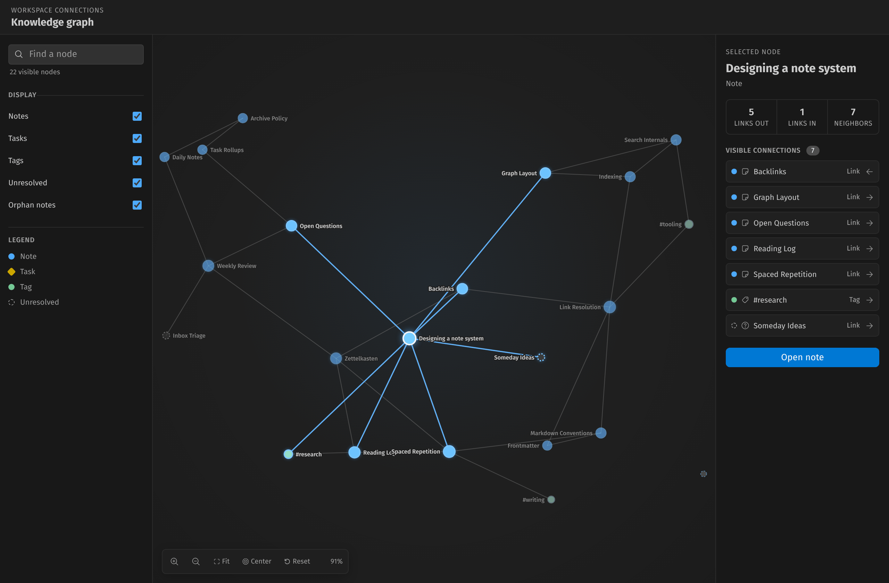
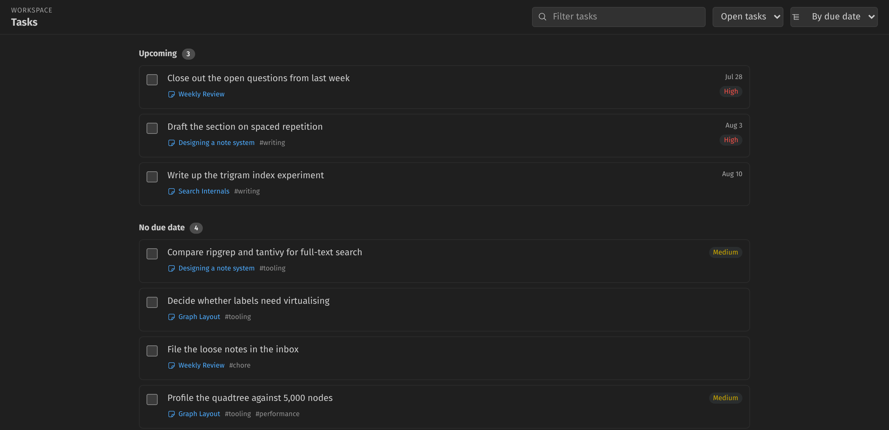

# Visp Notes

Visp Notes turns ordinary workspace Markdown files into a connected note system inside VS Code. Markdown remains the source of truth: there is no proprietary note database and no network service.



## Features

- Continuous Markdown editing with one natural CodeMirror document, Live/Markdown modes, undo history, search, bracket matching, list continuation, and explicit sync/conflict status
- `[[wiki links]]`, aliases, heading links, block references, context-aware completion, exact-anchor navigation, and missing-anchor diagnostics
- Live presentation of callouts (`> [!note]`), inline code, thematic breaks, and frontmatter as a property block
- A one-row note header with its location, tags, backlink count, save state, and an overflow menu
- A note inspector beside the note: its outline, backlinks with source context, its tasks, and its links out
- Standard Markdown checkbox tasks, Toggle Task, tickable tasks in the Activity Bar, and dashboards grouped by due date, note, or tag
- Due times and reminders: `@due(2026-07-22 14:30) @remind(30m)` raises a notification with Open Note, Snooze and Mark Done
- A `/` block menu in the note editor, and a folder picker when creating a note
- Interactive one- and two-hop local graphs plus a live force-directed workspace graph, with spring motion, connection-scaled nodes, hover neighborhoods, pan, cursor-centered zoom, fit/center controls, non-destructive search, and connection details
- Safe note rename choices with a native before/after diff preview
- Broken-link diagnostics
- A Due Today view holding overdue work as well as today's, and note lists for orphans, broken links and any tag
- Note folders, smart views, tags, full-text search, and index status in the Activity Bar

Headings, quotes, callouts, tables, and fenced code read as themselves while the caret is
elsewhere, and the raw Markdown comes back on whichever line you are editing — the text never
leaves the document.



Every note, tag, and unresolved link in the workspace, with the selected note's connections
listed beside it.



Checkbox tasks from every note in one place, grouped by due date, note, or tag.



## Getting started

1. Open a folder containing Markdown files.
2. Open **Visp Notes** from the Activity Bar.
3. Run **Visp Notes: New Note**. New notes open in the Visp Notes editor in Live mode; use the toolbar to switch to raw Markdown without changing editors or losing your selection and undo history.
4. Type `[[` anywhere to fuzzy-search notes and aliases. Continue with `#` for headings or `^` for block IDs. You can also press `Ctrl+Shift+L` (`Cmd+Shift+L` on macOS) to insert a note link at the active caret.

New notes are created under `notes/` by default. Change `vispNotes.notesFolder` to use another workspace-relative folder.

### Opening existing notes in the Visp Notes editor

Installing Visp Notes does not take over the Markdown files you already have. A `README.md` or `CHANGELOG.md` keeps opening in VS Code's own text editor, and the Visp Notes editor is one of the choices offered by **Reopen Editor With…**.

To open every Markdown file in Visp Notes by default, run **Visp Notes: Use Visp Notes as the Default Markdown Editor**. That writes the standard `workbench.editorAssociations` setting, so VS Code's own editor-association UI stays in charge of it. **Visp Notes: Restore the Built-in Markdown Text Editor** undoes it without disturbing associations other extensions have set.

Commands that open a note — **New Note**, tree items, wiki-link navigation, **Open Local Graph** — always use the Visp Notes editor regardless of this setting.

## Markdown conventions

Wiki links support aliases, headings, and block IDs:

```md
[[Architecture decisions]]
[[Architecture decisions|system design choices]]
[[Architecture decisions#Indexing]]
[[Architecture decisions^parser-block]]
[[Architecture decisions#Indexing^parser-block]]
```

Add an explicit block ID after a paragraph or heading to make it addressable:

```md
The index is rebuilt from Markdown. ^parser-block
```

In the graph, nodes settle through a live force simulation using quadtree (Barnes–Hut) repulsion, which keeps layout quality steady as a workspace grows to thousands of notes. Drag any visible dot or label to reshape the graph: linked nodes respond through springs, nearby nodes repel each other, and released nodes settle with momentum. Select a node to keep its neighborhood visible, or use **Reset** to restart the automatic layout. Larger dots indicate more visible connections. Drag empty canvas space to pan, use the wheel or trackpad to zoom around the pointer, and use **Fit** or **Center** to recover the view. Search highlights matches without removing their surrounding context; press Enter or Shift+Enter to cycle through results.

Callouts are ordinary blockquotes whose first line declares a type. In Live mode the marker collapses to an icon and the block takes on the matching accent; the Markdown underneath is untouched:

```md
> [!note] Current direction
> Keep files human-readable.

> [!warning] Migration needed
> The old index format is dropped in 0.3.
```

Types map onto six tones — note, tip, important, warning, danger, success — and aliases such as `info`, `caution`, `bug`, or `done` resolve to the closest one. An unrecognised type renders as a note rather than as plain text.

Tasks stay valid Markdown. Optional metadata is read without changing the line:

```md
- [ ] Prototype live editing @due(2026-07-22) @priority(high) #product
      <!-- task:stable-id -->
```

A due date may name a time of day, and a task may ask to be reminded before it:

```md
- [ ] Ship the release @due(2026-07-22 14:30) @remind(30m)
```

When the reminder moment arrives, Visp Notes shows a notification offering to open the note,
snooze for ten minutes, or mark the task done. A date-only `@due(…)` fires at
`vispNotes.reminders.defaultTime`. Reminders are VS Code notifications, so they only appear
while a window is open. A due already past — including one you add after the fact — notifies
once, so long as it is no older than `vispNotes.reminders.catchUpWindowHours`.

A due may also be a full ISO 8601 timestamp. One that names a zone —
`@due(2026-08-15T18:00:00Z)` — is a fixed instant: the notification fires at that instant,
while the task lists and groups under the *written* date. Near a midnight boundary those can
differ; write zone-less dues if you want the two to always agree.

Typing `/` at the start of a line in the Visp Notes editor opens a block menu — headings,
lists, tasks, tables, callouts, code blocks, dividers, `@due(…)`, `@remind(…)`, today's date,
a wiki link, a tag. It only opens where a block can start, so a slash inside prose, a URL or a
date is left alone.

Tags can also be managed from the editor's context strip: frontmatter tags carry a remove
control, and the `+` chip opens a picker over every tag in the workspace. Tag editing only
ever touches frontmatter — an inline `#tag` belongs to the sentence around it, so it is shown
greyed rather than removed for you. `Visp Notes: Add Tag` and `Visp Notes: Remove Tag` do the
same from the Command Palette.

Frontmatter can supply a title, aliases, and tags:

```yaml
---
title: Architecture decisions
aliases: [ADRs, Design records]
tags: [engineering, architecture]
---
```

## Commands

- `Visp Notes: New Note`
- `Visp Notes: New Task`
- `Visp Notes: Toggle Task`
- `Visp Notes: Insert Link`
- `Visp Notes: Show Backlinks` (opens the note with its inspector showing)
- `Visp Notes: Open Local Graph`
- `Visp Notes: Open Workspace Graph`
- `Visp Notes: Toggle Live / Markdown`
- `Visp Notes: Rename Note and Update Links`
- `Visp Notes: Delete Note` (also on a note's right-click menu in the workspace panel)
- `Visp Notes: Find Broken Links`
- `Visp Notes: Rebuild Index`
- `Visp Notes: Search Notes and Tasks`
- `Visp Notes: Add Tag`
- `Visp Notes: Remove Tag`
- `Visp Notes: Use Visp Notes as the Default Markdown Editor`
- `Visp Notes: Restore the Built-in Markdown Text Editor`

## Settings

- `vispNotes.notesFolder` — workspace-relative folder new notes default to.
- `vispNotes.newNote.askFolder` — ask which folder a new note belongs in. The configured folder is preselected, so Enter accepts it.
- `vispNotes.reminders.enabled` — notify when a task falls due.
- `vispNotes.reminders.defaultTime` — time of day a date-only `@due(…)` fires at.
- `vispNotes.reminders.leadMinutes` — default lead for a task with no `@remind(…)`.
- `vispNotes.reminders.catchUpWindowHours` — how far back to look for reminders missed while VS Code was closed.
- `vispNotes.exclude` — glob patterns kept out of the index.
- `vispNotes.editor.fontFamily` — font for rendered note prose. Leave empty to follow VS Code's interface font. Fenced and inline code always follow `editor.fontFamily`.
- `vispNotes.editor.contentWidth` — `readable`, `wide`, or `full` measure for note content. Also changeable from the editor's context strip, which writes this setting so every open note agrees.
- `vispNotes.graph.defaultDepth` — default local-graph link depth.
- `vispNotes.openRenderedAfterCreate` — open newly created notes in the Visp Notes editor.

## Data safety

The index is an in-memory, disposable projection rebuilt from workspace Markdown. Editor changes cross into the extension host as ordered, narrow UTF-16 patches. The host retains the newest draft, coalesces rapid typing, serializes `WorkspaceEdit` calls, and validates the authoritative document before each write. External changes never silently replace local typing: the editor presents an explicit choice to keep the local draft or use the external version. A draft that cannot be applied is stored in workspace-scoped extension state so it can be recovered after a panel or VS Code reload.

Live and Markdown modes are two presentations of the same CodeMirror document. Switching modes therefore preserves the caret, selection, scroll position, and undo history. `Ctrl+S` waits for the latest queued edit before saving.

Heading and block references are validated against their target note. A link is considered healthy only when both the note and every requested anchor exist.

Rename operations are staged: Visp Notes opens a native before/after diff, confirms the destination and affected files, performs an exclusive file rename, revalidates every affected source, and then applies one atomic text-only edit. If validation or content editing fails, it automatically rolls the file name back.

## Development

Requirements: Node.js 20 or newer and VS Code 1.96 or newer.

```sh
npm install
npm run lint
npm run check            # lint, then type-check every TypeScript project
npm test                 # pure-logic suites
npm run test:integration # drives a real VS Code build against a scratch workspace
npm run compile
```

`test:integration` downloads a VS Code build on first run into `.vscode-test/`. On a
headless machine run it under `xvfb-run`, as CI does — the extension host is a real window.

`npm run compile` also copies the Codicon font into `media/codicons`, which the webviews load so their icons match the rest of VS Code. Both `media/scripts` and `media/codicons` are build output and are not committed.

CI runs lint, type-check, tests, build, and `vsce package` on every push and pull request.

Press `F5` in VS Code to launch an Extension Development Host. See `docs/architecture.md` for module boundaries and data flow.

## Current scope

Version 0.2 is local-first and workspace-scoped. Collaboration, cloud sync, recurring tasks, semantic search, AI features, spatial canvases, and an external extension API are intentionally outside this release.
