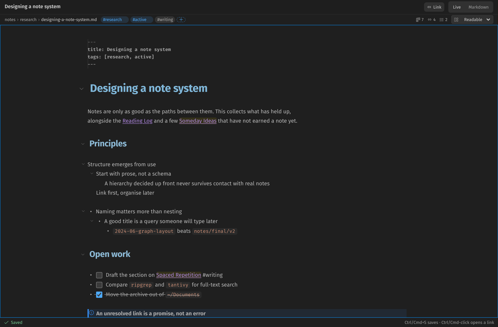
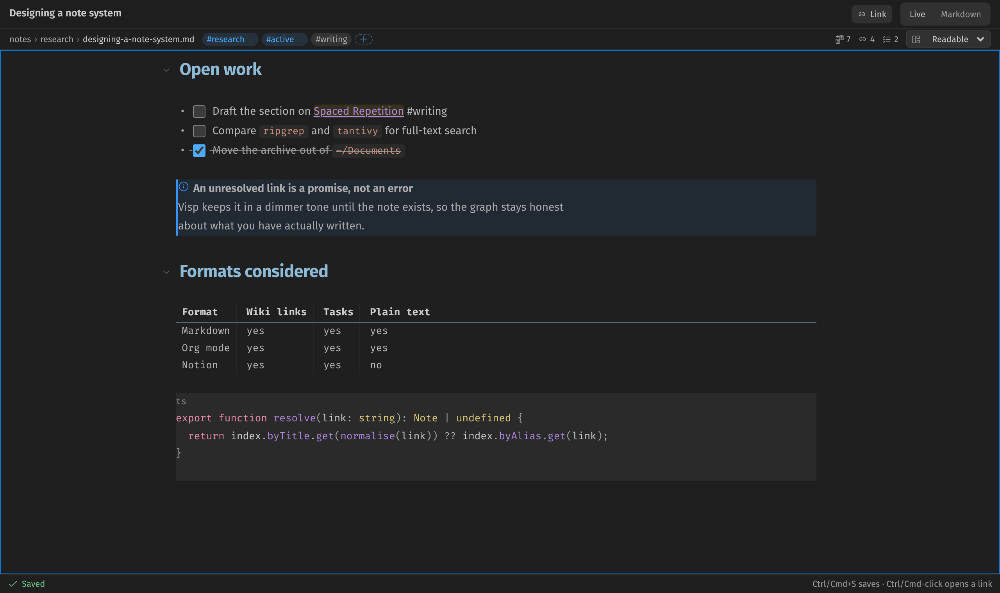
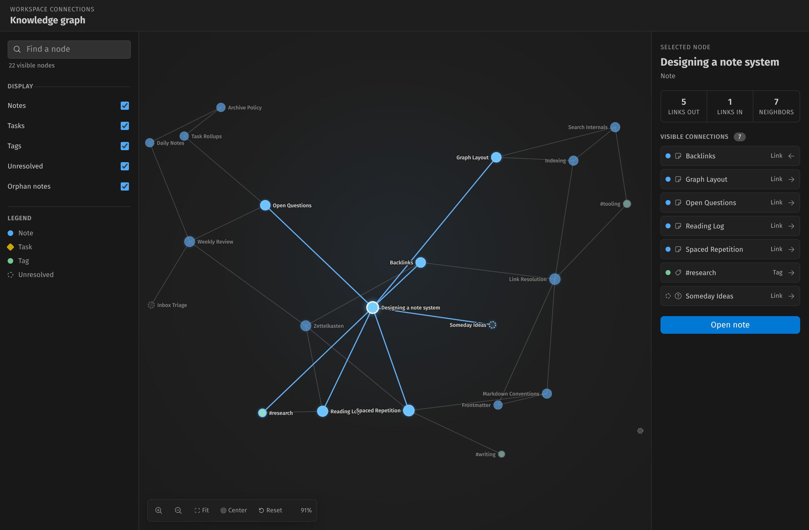
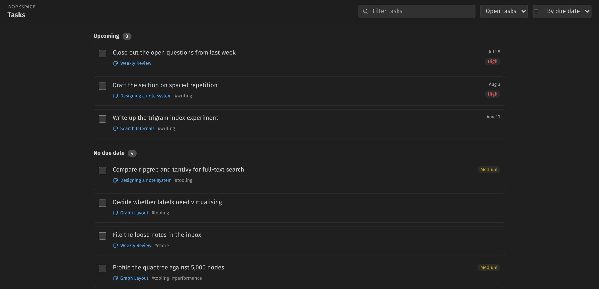

# Visp Notes

**A linked knowledge base for your repository, read by you and your AI agents.**

Keep design notes, decision records, runbooks and plans as plain Markdown next to your code. Visp Notes links them with `[[wiki links]]`, tracks the tasks written inside them, and draws the graph of how they connect. It gives that same graph to Copilot, Claude Code, Cursor and any other MCP client, so an agent working in your repo can find the decision behind the code instead of guessing at it.

- **For you:** live Markdown editing, backlinks, a knowledge graph, and tasks with due dates and reminders, without leaving VS Code.
- **For your agents:** tools to search notes, read a note with its links and backlinks, walk the graph, trace how two notes connect, and list what's overdue. They're built into Copilot's agent mode, and one command connects Claude Code or Cursor. See [AI agents](#ai-agents).
- **Just files:** Markdown stays the source of truth. There's no database, no account, and no network service.



## Features

### Editor

- One continuous CodeMirror document with **Live** and **Markdown** modes. Switching keeps the caret, selection, scroll position and undo history.
- Live rendering of headings, lists, tables, fenced code, callouts (`> [!note]`), thematic breaks and frontmatter. The raw Markdown returns on the line you are editing.
- A `/` block menu, formatting shortcuts (bold, italic, inline code, strikethrough), list continuation, bracket matching and in-note search.
- Spell checking with a bundled English dictionary. Code, wiki links, tags and frontmatter are never checked. Click an underlined word for corrections or to add it to your dictionary.
- A one-row note header with location, tags, backlink count and save state, and a note inspector showing the outline, backlinks, tasks and outgoing links.
- A Mac-style interface: San Francisco on macOS, and the bundled Inter everywhere else.

### Links

- `[[wiki links]]` with aliases, heading links and block references, fuzzy completion and exact-anchor navigation.
- Diagnostics for broken links and missing anchors, plus **Create Missing Note** for a link that points nowhere.
- Safe renames: **Rename Note and Update Links** previews a native before/after diff. Renaming or moving a note in the Explorer keeps links to it working.

### Tasks

- Standard Markdown checkbox tasks with optional `@due(…)`, `@remind(…)` and `@priority(…)` metadata.
- A Tasks panel grouped by due date, note or tag, with search, status and sort controls that are remembered between sessions.
- A Due Today view that includes overdue work.
- Reminder notifications with Open Note, Snooze and Mark Done.

### Knowledge graph

- A live, force-directed workspace graph, and one- or two-hop local graphs around a note.
- Full-text graph search with result previews, next/previous match navigation, and a **Matches + neighbours** mode.
- Node-type and orphan filters, drag-to-reshape, pan, zoom centred on the pointer, and Fit and Center controls.

### Workspace panel

- An Activity Bar panel with the knowledge graph, Tasks, Due Today, Broken Links, Orphans, Recent notes, note folders and tags, plus index status.
- Note lists with search, tag filters, natural title/path sorting, and comfortable or compact rows.
- One search across every note and task (`Shift+Alt+N`), with `path:`, `tag:`, `is:` and `modified:` filters.

## A closer look

Headings, quotes, callouts, tables, and fenced code read as themselves while the caret is
elsewhere, and the raw Markdown comes back on whichever line you are editing — the text never
leaves the document.



Every note, tag, and unresolved link in the workspace, with the selected note's connections
listed beside it.



Checkbox tasks from every note in one place, grouped by due date, note, or tag.



## AI agents

Visp Notes answers the questions an agent can't answer by reading files one at a time: which notes link here, what's connected to this, how do these two ideas relate, what's overdue. Every answer names notes by their workspace path, so the agent can go straight to its own file tools to edit them. The tools only read; they never change your notes.

| Question | Copilot (`#` reference) | MCP tool |
| --- | --- | --- |
| The note that's open, with unsaved edits | `#activeNote` | — |
| A note with its links out, backlinks in context, and tasks | `#vispNote` | `read_note` |
| Search notes and tasks with `path:`, `tag:`, `is:` and `modified:` filters | `#vispSearch` | `search_notes` |
| Notes one or two links away, links to missing notes, and notes that share a tag but aren't linked | `#vispGraph` | `note_graph` |
| The shortest chain of links between two notes | `#vispPath` | `link_path` |
| Tasks, overdue first, by status, due date, tag or note | `#vispTasks` | `list_tasks` |

Try *"Using #vispGraph, suggest three notes this one should link to"*, or ask Claude Code *"What's overdue in my notes, and which decisions does it depend on?"*

### Copilot and other VS Code chat

Nothing to set up. The tools are available in Copilot's agent mode, and in any chat extension that uses VS Code's language-model tools. Chat doesn't count a note open in the Visp Notes editor as "the current file", so use **Ask Chat About This Note** (the chat button in the note's title bar) to attach it, or reference `#activeNote`.

### Claude Code, Cursor and other MCP clients

Run **Visp Notes: Connect AI Agents (MCP)…** and pick your agent:

- **Claude Code** adds the server to `.mcp.json` in the workspace.
- **Cursor** adds it to `.cursor/mcp.json`.
- **Another MCP client** copies the configuration, with the exact command and paths, to the clipboard.

Restart the agent afterwards. The server is a single file that runs with Node.js 18 or newer. It reads the notes straight from disk, with the same parsing and the same `vispNotes.exclude` and `vispNotes.maxNoteSizeKB` settings as the extension, so VS Code doesn't need to be running. The config holds paths on your machine, so keep it out of version control.

## Getting started

1. Open a folder containing Markdown files.
2. Open **Visp Notes** from the Activity Bar.
3. Run **Visp Notes: New Note**. New notes open in the Visp Notes editor in Live mode; use the toolbar to switch to raw Markdown without changing editors or losing your selection and undo history.
4. Type `[[` anywhere to fuzzy-search notes and aliases. Continue with `#` for headings or `^` for block IDs. You can also press `Shift+Alt+L` (`Cmd+Alt+L` on macOS) to insert a note link at the active caret.
5. Press `Shift+Alt+N` (`Cmd+Alt+N` on macOS) to search every note and task by title, path, alias, tag, or text. Narrow a query with `path:meetings`, `tag:finance`, `is:note`, `is:task`, `is:open`, `is:done` or `modified:7d` (also `12h`, `2w`, `today`, or a date). Quote a value with a space in it — `path:"my notes"` — and quote the whole thing to search for the text instead. The same query works in the panel's filter box.

New notes are created under `notes/` by default. Change `vispNotes.notesFolder` to use another workspace-relative folder.

### Opening existing notes in the Visp Notes editor

Installing Visp Notes does not take over the Markdown files you already have. A `README.md` or `CHANGELOG.md` keeps opening in VS Code's own text editor, and the Visp Notes editor is one of the choices offered by **Reopen Editor With…**.

To open every Markdown file in Visp Notes by default, run **Visp Notes: Use Visp Notes as the Default Markdown Editor**. That writes the standard `workbench.editorAssociations` setting, so VS Code's own editor-association UI stays in charge of it. **Visp Notes: Restore the Built-in Markdown Text Editor** undoes it without disturbing associations other extensions have set.

Commands that open a note — **New Note**, tree items, wiki-link navigation, **Open Local Graph** — always use the Visp Notes editor regardless of this setting.

## Markdown conventions

Wiki links support aliases, headings, and block IDs:

```md
[[Architecture decisions]]
[[Architecture decisions|system design choices]]
[[Architecture decisions#Indexing]]
[[Architecture decisions^parser-block]]
[[Architecture decisions#Indexing^parser-block]]
```

Add an explicit block ID after a paragraph or heading to make it addressable:

```md
The index is rebuilt from Markdown. ^parser-block
```

### Callouts

Callouts are ordinary blockquotes whose first line declares a type. In Live mode the marker collapses to an icon and the block takes on the matching accent; the Markdown underneath is untouched:

```md
> [!note] Current direction
> Keep files human-readable.

> [!warning] Migration needed
> The old index format is dropped in 0.3.
```

Types map onto six tones — note, tip, important, warning, danger, success — and aliases such as `info`, `caution`, `bug`, or `done` resolve to the closest one. An unrecognised type renders as a note rather than as plain text.

### Tasks and reminders

Tasks stay valid Markdown. Optional metadata is read without changing the line:

```md
- [ ] Prototype live editing @due(2026-07-22) @priority(high) #product
      <!-- task:stable-id -->
```

A due date may name a time of day, and a task may ask to be reminded before it:

```md
- [ ] Ship the release @due(2026-07-22 14:30) @remind(30m)
```

When the reminder moment arrives, Visp Notes shows a notification offering to open the note,
snooze for ten minutes, or mark the task done. A date-only `@due(…)` fires at
`vispNotes.reminders.defaultTime`. Reminders are VS Code notifications, so they only appear
while a window is open. A due already past — including one you add after the fact — notifies
once, so long as it is no older than `vispNotes.reminders.catchUpWindowHours`.

A due may also be a full ISO 8601 timestamp. One that names a zone —
`@due(2026-08-15T18:00:00Z)` — is a fixed instant: the notification fires at that instant,
while the task lists and groups under the *written* date. Near a midnight boundary those can
differ; write zone-less dues if you want the two to always agree.

### Block menu and tags

Typing `/` at the start of a line in the Visp Notes editor opens a block menu — headings,
lists, tasks, tables, callouts, code blocks, dividers, `@due(…)`, `@remind(…)`, today's date,
a wiki link, a tag. It only opens where a block can start, so a slash inside prose, a URL or a
date is left alone.

Tags can also be managed from the editor's context strip: frontmatter tags carry a remove
control, and the `+` chip opens a picker over every tag in the workspace. Tag editing only
ever touches frontmatter — an inline `#tag` belongs to the sentence around it, so it is shown
greyed rather than removed for you. `Visp Notes: Add Tag` and `Visp Notes: Remove Tag` do the
same from the Command Palette.

Frontmatter can supply a title, aliases, and tags:

```yaml
---
title: Architecture decisions
aliases: [ADRs, Design records]
tags: [engineering, architecture]
---
```

## Knowledge graph

Nodes settle through a live force simulation using quadtree (Barnes–Hut) repulsion, which keeps the layout steady as a workspace grows to thousands of notes. Larger dots have more visible connections.

- **Move around.** Drag empty canvas to pan, and use the wheel or trackpad to zoom around the pointer. **Fit** and **Center** recover the view.
- **Reshape.** Drag any dot or label. Linked nodes follow through springs and released nodes settle with momentum. **Reset** restarts the automatic layout.
- **Select.** Clicking a node keeps its neighbourhood visible and lists its connections beside the graph.

**Search** covers note contents, titles, aliases, paths, tags and task text in the current graph. Switch to **Node labels** for a narrower search, or combine words with `"exact phrases"`, `path:research`, `tag:design`, `is:task`, `is:open`, `is:done` and `modified:7d`.

- The results panel shows short previews. Select a result to centre its node, or use its open button to jump to the matching text.
- `Enter` / `Shift+Enter` and the next/previous buttons cycle through every match. The first 100 results have previews, and every match stays highlighted and reachable.
- **Matches + neighbours** keeps only matching nodes and their direct connections on the canvas. Your zoom is kept while results refresh.
- Search respects the node-type filters and the local graph's scope. **Workspace graph** widens the scope to every indexed note.
- Search and filter choices survive webview reloads.

## Commands

All commands are in the Command Palette under **Visp Notes**.

| Area | Commands |
| --- | --- |
| Notes | New Note, Open Note, Create Missing Note, Rename Note and Update Links, Delete Note |
| Links | Insert Link, Show Backlinks, Find Broken Links |
| Tasks | New Task, Toggle Task, Open Tasks, Open Tasks Due Today |
| Graph | Open Local Graph, Open Workspace Graph |
| Editor | Toggle Live / Markdown, Bold, Italic, Inline Code, Strikethrough, Add Tag, Remove Tag |
| Workspace | Search Notes and Tasks, Rebuild Index |
| AI agents | Ask Chat About This Note, Connect AI Agents (MCP)… |
| Default editor | Use Visp Notes as the Default Markdown Editor, Restore the Built-in Markdown Text Editor |

## Keyboard shortcuts

| Action | Windows / Linux | macOS | Where |
| --- | --- | --- | --- |
| Search notes and tasks | `Shift+Alt+N` | `Cmd+Alt+N` | Anywhere |
| Insert link | `Shift+Alt+L` | `Cmd+Alt+L` | Markdown or Visp Notes editor |
| Show backlinks | `Ctrl+Shift+B` | `Cmd+Shift+B` | A Markdown note |
| Open local graph | `Ctrl+Shift+G` | `Cmd+Shift+G` | A Markdown file in the text editor |
| Bold / Italic | `Ctrl+B` / `Ctrl+I` | `Cmd+B` / `Cmd+I` | Visp Notes editor |
| Inline code | `Ctrl+E` | `Cmd+E` | Visp Notes editor |
| Strikethrough | `Ctrl+Shift+X` | `Cmd+Shift+X` | Visp Notes editor |

In graph search, `Enter` and `Shift+Enter` move to the next and previous match.

## Settings

**Notes and index**

- `vispNotes.notesFolder` (default `notes`): workspace-relative folder new notes default to. Every Markdown file in the workspace is still indexed.
- `vispNotes.newNote.askFolder` (default on): ask which folder a new note belongs in. The configured folder is preselected, so Enter accepts it.
- `vispNotes.openRenderedAfterCreate` (default on): open newly created notes in the Visp Notes editor.
- `vispNotes.exclude`: glob patterns kept out of the index. The default excludes `node_modules`, `.git`, `dist` and `out`.
- `vispNotes.maxNoteSizeKB` (default `5120`): notes larger than this are not indexed. `0` means no limit.
- `vispNotes.updateLinksOnFileMove.enabled` (`always` or `never`): rewrite wiki links when a note is renamed or moved from the Explorer. See [Data safety](#data-safety).
- `vispNotes.index.bypassProjectionCache` (default off): rebuild the whole index on every change. Slower; only useful for diagnosing a link that looks wrong.

**Editor**

- `vispNotes.editor.fontFamily`: font for rendered note prose. Leave empty for the bundled Mac-style face (San Francisco on macOS, Inter elsewhere). `IBM Plex Sans` is also bundled. Code always follows `editor.fontFamily`.
- `vispNotes.editor.contentWidth` (`readable`, `wide` or `full`): measure for note content. Also changeable from the editor's context strip.
- `vispNotes.editor.showInspector` (default on): show the inspector beside a note. Also toggled from the note header.
- `vispNotes.spelling.enabled` (default on): underline misspelled words and offer corrections.

**Panels and graph**

- `vispNotes.density` (`comfortable` or `compact`): row height in the workspace panel.
- `vispNotes.graph.defaultDepth` (`1` or `2`): default link depth for local graphs.

**Reminders**

- `vispNotes.reminders.enabled` (default on): notify when a task falls due.
- `vispNotes.reminders.defaultTime` (default `09:00`): time of day a date-only `@due(…)` fires.
- `vispNotes.reminders.leadMinutes` (default `0`): how many minutes early to remind about a task with no `@remind(…)`.
- `vispNotes.reminders.catchUpWindowHours` (default `24`): how far back to look for reminders missed while VS Code was closed.

## Data safety

The index is an in-memory, disposable projection rebuilt from workspace Markdown. Editor changes cross into the extension host as ordered, narrow UTF-16 patches. The host retains the newest draft, coalesces rapid typing, serializes `WorkspaceEdit` calls, and validates the authoritative document before each write. External changes never silently replace local typing: the editor presents an explicit choice to keep the local draft or use the external version. A draft that cannot be applied is stored in workspace-scoped extension state so it can be recovered after a panel or VS Code reload.

Live and Markdown modes are two presentations of the same CodeMirror document. Switching modes therefore preserves the caret, selection, scroll position, and undo history. `Ctrl+S` waits for the latest queued edit before saving.

Heading and block references are validated against their target note. A link is considered healthy only when both the note and every requested anchor exist.

Rename operations are staged: Visp Notes opens a native before/after diff, confirms the destination and affected files, performs an exclusive file rename, revalidates every affected source, and then applies one atomic text-only edit. If validation or content editing fails, it automatically rolls the file name back.

Renaming or dragging a note **in the Explorer** also updates the wiki links that would otherwise stop reaching it, and that is the one thing Visp Notes writes to files you did not open. It is worth knowing in advance, so: one drag can edit several notes, in a single undo step, and it never asks first — VS Code runs rename participants under a timeout with the Explorer frozen behind them, which leaves nowhere to put the question. Two things bound it. It never changes a word a link puts on the page: `See [[Target]] for details.` becomes `See [[Real Title|Target]] for details.`, so the sentence still reads as written and only the destination moves. And it is a setting — `vispNotes.updateLinksOnFileMove.enabled: never` turns it off entirely, after which links that named a moved note by its file name simply stop resolving. `Visp Notes: Rename Note and Update Links` is the path that asks, previews the diff, and will update the prose as well if that is what you want.

## Development

Requirements: Node.js 20 or newer and VS Code 1.96 or newer.

```sh
npm install
npm run lint
npm run check            # lint, then type-check every TypeScript project
npm test                 # pure-logic suites
npm run test:integration # drives a real VS Code build against a scratch workspace
npm run compile
```

`test:integration` downloads a VS Code build on first run into `.vscode-test/`. On a
headless machine run it under `xvfb-run`, as CI does — the extension host is a real window.

`npm run compile` also copies the Codicon font into `media/codicons`, which the webviews load so their icons match the rest of VS Code. Both `media/scripts` and `media/codicons` are build output and are not committed. The bundled fonts (`media/fonts/`, Inter and IBM Plex Sans) and the spelling dictionaries (`media/dictionaries/`) are checked in rather than installed from npm. Their licences are in `THIRD_PARTY_NOTICES.md`.

To try a local build in your own VS Code:

```sh
npx @vscode/vsce package
code --install-extension visp-notes-<version>.vsix --force
```

CI runs lint, type-check, tests, build, and `vsce package` on every push and pull request.

Press `F5` in VS Code to launch an Extension Development Host. See `docs/architecture.md` for module boundaries and data flow.

## Current scope

Visp Notes is local-first and workspace-scoped: it reads and writes Markdown files in the open workspace and makes no network requests. It has no AI model of its own. It gives the agents you already use read-only access to your notes, and whatever those agents send to their providers is governed by them. Collaboration, cloud sync, recurring tasks, semantic search and spatial canvases are outside this release.
